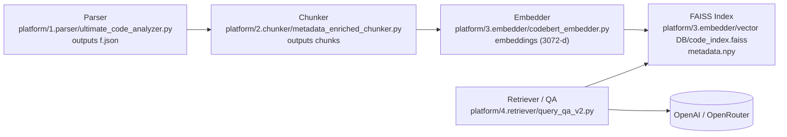

# CodeMind — Code Intelligence Pipeline

Simple project README with quick run steps and a flow diagram.

## What is this

CodeMind converts a codebase into searchable, LLM-powered code intelligence:
- Parse source code to extract structure and call-graphs
- Split analysis into semantic chunks with metadata
- Embed chunks and store in a FAISS vector index
- Run retrieval + LLM QA over the codebase

## Flow Diagram

The pipeline flow is shown below (image provided in the repository):


## Quick structure (key files)

- `platform/1.parser/ultimate_code_analyzer.py` — parse Java sources, output JSON (`output parser/f.json`)
- `platform/2.chunker/metadata_enriched_chunker.py` — create enriched chunks in `platform/2.chunker/chunk_Data/chunk`
- `platform/3.embedder/codebert_embedder.py` — create embeddings and FAISS index (`platform/3.embedder/vector DB/`)
- `platform/4.retriever/query_qa_v2.py` — interactive QA + retriever

## Quick start (local)

1. Activate virtualenv:

```bash
# CodeMind — Code Intelligence Pipeline

CodeMind turns a codebase into searchable, LLM-powered code intelligence by combining static analysis, semantic chunking, vector embeddings and FAISS-based retrieval. This README explains the architecture, how to run the pipeline locally, and common troubleshooting notes — in plain language.

## Highlights

- Parses source code and extracts method-level structure and call graphs.
- Converts analysis to semantically-rich chunks with metadata (file, method, callers).
- Generates vector embeddings for chunks (default: OpenAI `text-embedding-3-large`, 3072 dims).
- Stores embeddings in a FAISS index and serves retrieval + LLM QA over the project.

## Architecture (overview)

- Parser (CLI): `platform/1.parser/ultimate_code_analyzer.py` — analyzes Java sources using `tree-sitter` and writes `platform/1.parser/output parser/f.json`.
- Chunker (CLI): `platform/2.chunker/metadata_enriched_chunker.py` — converts parser JSON into chunk files at `platform/2.chunker/chunk_Data/chunk`.
- Embedder (CLI): `platform/3.embedder/codebert_embedder.py` — embeds chunks and builds FAISS index at `platform/3.embedder/vector DB/code_index.faiss` plus `metadata.npy`.
- Retriever / QA (interactive): `platform/4.retriever/query_qa_v2.py` — embeds queries, retrieves top-k from FAISS, constructs a prompt from retrieved chunks and calls OpenAI for answers.

Flow diagram (image included in repo):


Mermaid quick diagram (for docs or slides):



## Repository layout (key files)

- `platform/1.parser/ultimate_code_analyzer.py` — parser; input: `project/.../src/main/java`, output: `platform/1.parser/output parser/f.json`.
- `platform/2.chunker/metadata_enriched_chunker.py` — chunker; output: `platform/2.chunker/chunk_Data/chunk` (example: 647 chunks).
- `platform/3.embedder/codebert_embedder.py` — embedder; default uses OpenAI embeddings (`text-embedding-3-large`), generated files under `platform/3.embedder/vector DB/` (example: `code_index.faiss` ~8.6 MB, `metadata.npy` ~548 KB).
- `platform/4.retriever/query_qa_v2.py` — retriever + QA; interactive CLI.
- `.env` — (local) store your `OPENAI_API_KEY` or OpenRouter key here.

## Quick start (detailed)

1. Create & activate the virtual environment (if not already):

```bash
python3 -m venv venv
source venv/bin/activate
pip install -r requirements.txt
```

2. Add your OpenAI key into `.env` (at repo root):

```text
OPENAI_API_KEY=sk-...
```

3. Run the parser (example run — outputs JSON):

```bash
venv/bin/python platform/1.parser/ultimate_code_analyzer.py
# -> platform/1.parser/output parser/f.json
```

4. Run the chunker (produces chunk files):

```bash
venv/bin/python platform/2.chunker/metadata_enriched_chunker.py
# -> platform/2.chunker/chunk_Data/chunk
```

5. Generate embeddings & FAISS index (default uses OpenAI):

```bash
venv/bin/python platform/3.embedder/codebert_embedder.py
# -> platform/3.embedder/vector DB/code_index.faiss
```

6. Query the system (non-interactive example):

```bash
printf "Where is the accession test created?\nquit\n" | venv/bin/python platform/4.retriever/query_qa_v2.py
```

## Example outputs (what to expect)

- `platform/1.parser/output parser/f.json` contains an array of method entries. Example entry:

```json
{
	"file": "src/main/java/org/.../OpenElisAccession.java",
	"method": "createAccession",
	"start_line": 120,
	"end_line": 162,
	"calls": ["validate", "saveToDb"],
	"complexity": 8
}
```

- A chunk looks like:

```json
{
	"id": "chunk_001",
	"code": "public Accession createAccession(...) { ... }",
	"metadata": { "method": "createAccession", "file": "..." }
}
```

- Embeddings: 3072-dimensional vectors using OpenAI `text-embedding-3-large` (example: 647 vectors generated in ~10s in the sample run). FAISS index file was ~8.6 MB in the example repository.

## Troubleshooting

- Use the virtualenv Python (`venv/bin/python`) — running with the system Python will likely raise `ModuleNotFoundError` for project dependencies.
- GraphCodeBERT (local) may segfault on macOS / Apple Silicon. Default mode uses OpenAI embeddings. If you need local models, use Linux x86 or a supported GPU environment.
- If `git push` stalls or fails, large files may be included. The FAISS index and chunk files are generated artifacts and should be ignored and untracked:

```bash
git rm --cached -r "platform/3.embedder/vector DB/" "platform/2.chunker/chunk_Data/"
git commit -m "Remove generated DBs and chunks from repo; add to .gitignore"
git push -u origin main
```

## Security & secrets

- Never commit `.env` to git. Put `OPENAI_API_KEY` in `.env` or set in your environment.
- For production, consider using a secrets manager and private artifact storage for FAISS indexes.

## Production recommendations

- Containerize each stage (parser, chunker, embedder, retriever) so they can run independently and scale.
- Persist FAISS indexes to a shared object store (S3, Azure Blob) or a managed vector DB for large projects.
- Add a lightweight API in front of the retriever for integration with UIs/Slack/VSCode.

## Development notes

- Tests: unit test harnesses live under `platform/*/tests` (if present) — run with `pytest`.
- Code style: follow repo's formatting rules; run `black`/`ruff` if configured.

## FAQ (short)

- Q: How accurate are answers? A: Accuracy depends on the retrieved chunks — retrieval + grounding reduces hallucination significantly.
- Q: Can I use a different LLM? A: Yes — update the calls in `platform/4.retriever/query_qa_v2.py` to point to your LLM endpoint.
- Q: How to regenerate the FAISS index? A: Re-run the embedder after generating chunks.

---

If you'd like, I can also:

- add this as `docs/architecture.md` with the Mermaid diagram rendered,
- prepare a short slide deck of 6–8 slides for demos,
- or commit these README changes and push them to `origin/main` for you.
